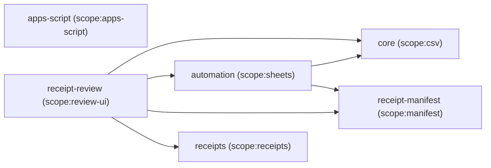

# CLAUDE.md

This file provides guidance to Claude Code (claude.ai/code) when working with code in this repository.

## What this is

A TypeScript/pnpm monorepo that converts a Citi.com transaction export CSV into a CSV formatted for a Google Sheets expense-splitting workflow, and pushes that data straight into the shared sheet via an extended Apps Script instead of manual copy-paste — either from the CLI (`packages/automation`) or from a local web UI (`packages/receipt-review`) that also handles Costco receipt review and lets you preview a sync before anything is pushed. It excludes personal-only, payer-specific transactions (transfers, individual purchases, etc.) and classifies every remaining transaction as either "split equally" (including known shared/joint bills) or "split variably" for a configurable set of vendors.

This was ported from an original Python implementation; see git history for that version if needed. The port fixed two real bugs discovered by testing against a real export:

- The Python version assumed Mint's CSV layout (`Date, Description, Original Description, Amount`). The actual input is Citi's layout (`Status, Date, Description, Debit, Credit, Member Name`) — completely different column order. Import now maps columns by header name instead of by position.
- Vendor-list matching (`personalExclusions`, `splitRulesDict`) is case-insensitive. Citi's descriptions are mostly ALL CAPS; several vendor-list entries (e.g. `'Costco'`, `'Web Authorized Pmt'`) are mixed/title case and never matched under case-sensitive comparison.
- Refund amounts (a populated `Credit` column that isn't a card payment) preserve their negative sign instead of being forced positive — see `normalizeAmount` in `importFileToLines.ts`.

## Package layout (pnpm workspace)

- `packages/core` — the conversion engine, ported 1:1 in behavior (plus the fixes above) from the original Python `csvTools`/`main.py`. Dependency-light: `csv-parse`/`csv-stringify` for CSV I/O, otherwise Node stdlib.
- `packages/automation` — Sheets API + Apps Script API client and sync orchestrator (see "Google Sheets automation" below).
- `packages/receipts` — receipt-to-split-percentage pipeline (local VLM extraction + a Prisma/SQLite datastore of item price/split history) — see "Receipt importer" below and [`costco-receipt-importer.md`](costco-receipt-importer.md) at the repo root for the full phased plan.
- `packages/receipt-manifest` — the receipt manifest's type (`ManifestEntry`/`Manifest`) and read/write functions (`readManifest`/`appendManifestEntry`), split out into its own dependency-light package (Node `fs`/`path` only) so both `packages/receipt-review` (which writes it) and `packages/automation` (which reads it, see "Google Sheets automation" below) can depend on it without either pulling in the other's dependency tree (Hono/React vs. nothing).
- `packages/receipt-review` — the local review web UI (Hono API + Vite/React frontend) on top of `packages/receipts` for receipts and `packages/automation` for CSV import/sync — see "Receipt review web UI" below.

Root-level tooling: `pnpm-workspace.yaml`, `tsconfig.base.json` (strict mode, extended per-package), `.npmrc` (`save-exact=true`), and `pnpm-workspace.yaml`'s supply-chain settings (`minimumReleaseAge`, `blockExoticSubdeps`, `trustPolicy`, `allowBuilds`) — **dependency versions are pinned exactly, no `^`/`~` ranges**; use `pnpm add --save-exact` (or rely on `.npmrc`) when adding anything new, and update `allowBuilds` deliberately rather than blanket-approving postinstall scripts.

## Dependency map

The real edges between packages (from `nx graph`, not guessed from `package.json`) are a clean two-layer-plus-app shape:



- **Foundational leaves** — `core`, `receipt-manifest`, `receipts`, `apps-script` — have **zero** internal dependencies on each other. Each is independently usable and testable in isolation: `core` and `automation` (below) both double as standalone CLIs (`node dist/main.js ...`, `nx run automation:sync`/`:authorize`) as well as libraries; `receipts` has its own CLI targets (`ingest`/`seed`/`snapshot`/`restore`); `receipt-manifest` is pure library glue with no CLI of its own; `apps-script` is deployed independently via `clasp` and isn't even part of the TS project-reference graph (see "Google Sheets automation" below).
- **`automation`** is the one mid-tier package — it only builds on the foundational leaves (`core` + `receipt-manifest`), never on `receipts` or `receipt-review`.
- **`receipt-review`** is the single integrator — the actual running pipeline (Hono API + Vite/React) that depends on everything else. Nothing depends on it.
- `receipt-manifest` exists as its own package specifically so `receipt-review` (which writes it) and `automation` (which reads it) don't have to pull in each other's dependency tree just to share one small type — the running example of this layering paying off, not just a diagram.

**This is enforced, not just descriptive.** Each package's `project.json` carries a `scope:*` tag, and `eslint.config.mjs`'s `@nx/enforce-module-boundaries` rule constrains exactly which scopes each may depend on (foundational leaves: none; `scope:sheets`: only the leaves; `scope:review-ui`: anything). `pnpm lint` catches a violation immediately — e.g. `core` importing from `automation` fails with a circular-dependency error (since `automation` already depends on `core`), and `receipt-manifest` importing from `receipts` fails with "cannot depend on any libs with tags" even though no cycle exists.

## Running it

```bash
cd packages/core
pnpm build
node dist/main.js <input_file.csv> EXPENSE_SPLITTING <PayerName>
```

Or during development, skip the build step: `pnpm exec tsx src/main.ts <input_file.csv> EXPENSE_SPLITTING <PayerName>` from `packages/core`.

Example:

```bash
node dist/main.js transactions.csv EXPENSE_SPLITTING Brian
```

`<PayerName>` must exist (case-insensitively) as a key in `personalExclusions` in [packages/core/src/csvConverterFactory.ts](packages/core/src/csvConverterFactory.ts) — this determines which set of personal, non-splittable transaction descriptions get excluded for that payer. Currently supported names: `PATRICE`, `BRIAN`. `--help`/`-h` is also supported.

`EXPENSE_SPLITTING` is currently the only supported `outputFormat`; any other value throws an `Error` naming the bad format.

Run the full workspace test suite from the repo root with `pnpm test` (or `nx test @mint-csv-converter/core` for just the converter), typecheck with `pnpm typecheck`, and lint with `pnpm lint` — these run across all six packages. See "Task orchestration (Nx)" below.

## Architecture

Three-stage pipeline wired together in [packages/core/src/main.ts](packages/core/src/main.ts):

1. **Import** — `ImportFileToLines` ([packages/core/src/importFileToLines.ts](packages/core/src/importFileToLines.ts)) reads the input CSV, locates `Date`/`Description`/`Debit`/`Credit` by header name (case-insensitive, order-independent), and normalizes each row to `[date, description, '', amount]` — `amount` comes from whichever of Debit/Credit is populated, sign preserved (see refund handling above).
2. **Convert** — `CsvConverterFactory` ([packages/core/src/csvConverterFactory.ts](packages/core/src/csvConverterFactory.ts)) is keyed on `outputFormat` string, dispatching to a converter method (currently only `convertToExpenseSplitting`). That method:
   - Skips the header row (index 0).
   - Iterates rows in reverse, and for each row checks `isValidLine` against `personalExclusions[<PAYER_NAME>]` (case-insensitive substring match against `line[1]`, the description). Matching lines are personal spending and are routed to `invalidLines`; everything else is kept.
   - For kept lines, checks `isVariableSplit` against `splitRulesDict.VARIABLE` to decide whether the row is tagged `"Variably"` (split `%`/`%`) or `"Equally"` (split `TRUE`/`TRUE`). `splitRulesDict.SHARED` is documentation of known joint bills (e.g. mortgage, insurance) that also land in the `"Equally"` bucket — it isn't branched on separately in code since that's already the default for any non-excluded, non-variable transaction.
   - Returns a `[result, invalidLines]` tuple. Output columns are: `date + description`, payer name, amount (`line[3]`), split type, and two split-ratio columns.
   - `sorted` (default `true`) sorts `result` by that first column (`"<description> <date>"`, so effectively by description) before returning, grouping same-vendor purchases together instead of leaving them in raw reverse-input order — set an instance's `sorted = false` to restore the old unsorted behavior.
3. **Export** — `ExportFileToLines` ([packages/core/src/exportFileToLines.ts](packages/core/src/exportFileToLines.ts)) writes both `result` and `invalidLines` out as separate CSV files, named `<name>_<timestamp>_<VALID|INVALID>_csvConverter.csv`, into the current working directory.

### Adding a new payer

Add a new uppercase key to `personalExclusions` in `CsvConverterFactory` with a list of description substrings that should be excluded (personal-only spending, transfers, etc.) for that payer. The key must match the `name` CLI arg uppercased. Matching is case-insensitive, so casing in the list doesn't need to match the export's casing.

### Adding a new output format

Add a new `outputFormat` branch in `getConverter` pointing to a new `convertTo*` method following the same `(lines, name) -> [result, invalidLines]` signature.

## Google Sheets automation

Input is always a manually-exported Citi CSV — Playwright-based export automation was considered and explicitly ruled out (bot-detection risk not worth it for this).

- [packages/apps-script/src/Code.ts](packages/apps-script/src/Code.ts) — the existing sheet's Apps Script, logic untouched above the marker comment (type annotations added for local dev only), plus an appended `doPost` Web App endpoint (`addTransactionsForPeriod`) that finds-or-creates the `"<Payer> <Period>"` tab (duplicating `"DUPLICATE ME"` to preserve styling), inserts rows above the `"TOTAL OWING"` marker, and reuses the existing `onSplitTypeChanged`/`calculate()` for defaulting and settle-up math. Apps Script can't run TypeScript directly, so `pnpm build` bundles this to `dist/Code.js` via Rollup — that's what actually gets deployed. See that directory's README for build/deployment steps — deploying is a manual, one-time step in the Apps Script editor or via `clasp`; it can't be scripted from here.
- `packages/automation` — [sheetsClient.ts](packages/automation/src/sheetsClient.ts) (thin HTTP client for the endpoint above), [sync.ts](packages/automation/src/sync.ts) (orchestrator: imports a CSV via `@mint-csv-converter/core`, groups by transaction month, dedupes against a local sync-state file tracking the newest date already pushed per payer, and POSTs each group). See that package's README for setup/usage. Depends on `@mint-csv-converter/core`'s and `@mint-csv-converter/receipt-manifest`'s built `dist/` output; Nx handles this automatically (see below) — you don't need to manually rebuild those first.
- **Receipt-manifest sync (Phase 4 of `costco-receipt-importer.md`)**: for every `'Variably'` row, `sync.ts` calls [manifestMatch.ts](packages/automation/src/manifestMatch.ts)'s `matchManifestEntry` against the receipt manifest — filtering to entries matching the row's payer and whose store name is a substring of the transaction description (the `VARIABLE` vendor list entries, `'Costco'`/`'TARGET'`, already equal the manifest's store names), then to `cardAmount` within a cent of the transaction amount, tiebreaking multiple same-amount candidates by closest `purchaseDate`. A match's percentages travel as `AddTransactionsRequest.rowPercentages` (aligned 1:1 with `rows`, participant-name-keyed, e.g. `{ Brian: 62, Patrice: 38 }`) through to the Apps Script API's `finalizeAddedRows` call — out-of-band from the Sheets API `values.update` write (still `A:D` only, unchanged), since only the Apps Script side knows the sheet's actual participant column order. There, `sheetLayout.ts`'s `applyRowPercentages` writes the real split directly into the named participant columns instead of `onSplitTypeChanged`'s even default, for any row with a full-coverage match; unmatched or partial-coverage rows keep today's even-default behavior unchanged, so a sync is never blocked on a manifest lookup. **Redeploying the Apps Script build is required** before a real sync picks up this behavior.

## Receipt importer (packages/receipts)

Phase 1 of a larger plan (see [`costco-receipt-importer.md`](costco-receipt-importer.md)): given a store receipt PDF, render it to page images and ask a local Ollama vision model to extract line items as zod-validated structured JSON, resolve each item against a Prisma/SQLite datastore keyed on `(store, itemCode)` (falling back to a normalized name only when no code is present) to seed its split from that item's learned typical split, reconcile the extraction's arithmetic as a deterministic backstop against model errors, and persist everything transactionally. Store/participant/split data is modeled relationally (rows, not columns) so a new store or a third participant is a data change, not a schema migration. Driven by CLI/Nx targets (`ingest`, `seed`, `snapshot`, `restore`). See [packages/receipts/README.md](packages/receipts/README.md) for setup and usage.

`Receipt.status` is a Prisma `enum ReceiptStatus { EXTRACTED SUBMITTED }` (not a free-form string) — collapsed to two states rather than the three the design doc originally sketched (no separate `REVIEWED` status; see "Receipt review web UI" below for why). `packages/receipts/src/index.ts` re-exports `PrismaClient` and the generated model types (`Item`, `Participant`, `Receipt`, etc.) alongside the rest of its public API, since `packages/receipt-review` is now a real external consumer that needs them.

## Receipt review web UI (packages/receipt-review)

Phase 3 of the same plan: a local, single-user web app on top of `packages/receipts` — upload a receipt PDF, poll background extraction progress, review one receipt at a time (source PDF alongside an editable per-line split form, with price-history and new-vs-learned provenance hints), and submit. Submitting a receipt is a one-way `EXTRACTED` → `SUBMITTED` transition (no `REVIEWED` intermediate — collapsing that removed a batch-submit UI concern with no real payoff for a solo reviewer) that, in one transaction, upserts each item's `ItemSplitDefault` to the just-confirmed split (Phase 2's "the latest correction always wins" rule) and writes both a manifest entry (`~/.config/mint-csv-converter/receipt-manifest.json`, keyed by `cardAmount` + `purchaseDate` — read by `packages/automation`'s sync step, see "Google Sheets automation" below) and a generated audit-copy HTML (`~/.config/mint-csv-converter/receipt-audits/<id>.html`).

- **Backend**: [src/server/app.ts](packages/receipt-review/src/server/app.ts) — a [Hono](https://hono.dev) app (`export type AppType`) whose route logic is factored into plain, dependency-injected functions ([receiptQueries.ts](packages/receipt-review/src/server/receiptQueries.ts), [lineItemReview.ts](packages/receipt-review/src/server/lineItemReview.ts), [submitReceipt.ts](packages/receipt-review/src/server/submitReceipt.ts)) so specs exercise them against a real temp SQLite DB (`@mint-csv-converter/receipts`' `src/testing/testDb.ts`, deep-imported since it's a test-only helper not in that package's public `index.ts`) instead of mocking Prisma. `@hono/zod-validator` validates the one JSON request body (line-item splits) so the RPC client below gets a properly typed request, not just a typed response. File upload kicks off `ingestReceipt` **asynchronously** (extraction takes ~130-170s with the default model) tracked in an in-memory job map — no DB table, since a lost job on restart is harmless given `ingestReceipt`'s idempotent-by-content-hash design; the client polls `GET /api/uploads/:jobId` every 2s rather than using SSE/WebSockets.
- **Frontend**: Vite + React, no router library and no TanStack Query/Redux — the whole app is one upload screen, one queue list, and one review form, so plain `useState`/`useEffect` is enough. [src/client/lib/api.ts](packages/receipt-review/src/client/lib/api.ts) wires up `hono/client`'s `hc<AppType>()` for a fully-typed fetch client generated from the server's own route definitions, zero codegen. `@mui/material`/`@mui/icons-material` (+ `@emotion/react`/`@emotion/styled`) provides the component set and a calm custom `theme.ts` (muted sage/off-white palette via `ThemeProvider`/`CssBaseline`) applied once in `main.tsx`. Each line item is a single MUI `Slider` (0 = 100% Brian on the left, 100 = 100% Patrice on the right — see `resolveNames`/`ReceiptReviewPage.tsx`) instead of two separate percentage inputs. There's no per-line save step: `Submit receipt` PATCHes every line's current value (touched or not) and only then calls the submit endpoint, so an untouched slider at its default is an implicit "this is fine" rather than something that has to be separately confirmed — the backend's per-line PATCH endpoint and its "every line must be reviewed" submit guard are unchanged, the frontend just calls both for you in one click.
- **Reviewing/editing already-submitted receipts**: `packages/receipt-review/src/server/receiptQueries.ts`'s `listReceipts` returns every receipt regardless of status (needs-review ones sort first), and `ReviewQueuePage` shows them all in one table with a "Review" column (a warning icon vs. a checkmark) instead of separate tabs — each row also shows the current dollar-weighted aggregate split. Opening an already-`SUBMITTED` receipt shows a "Submitted \<date\>" chip and swaps the button to "Update splits"; clicking it re-runs the exact same submit path (`submitReceipt` in `submitReceipt.ts`), which already upserts both `ItemSplitDefault` and the manifest entry **by `receiptId`** — so correcting a submitted receipt's splits updates its existing manifest entry in place rather than duplicating it, with no backend changes needed for this to work.
- **Nx/build wiring**: excluded from the root `tsconfig.json`'s composite project-reference graph, same as `packages/apps-script` — its own `tsconfig.json` is a `"files": []` solution file referencing `tsconfig.app.json` (browser/DOM, `noEmit`) and `tsconfig.server.json` (Node, `noEmit`), with a hand-written `"typecheck"` package.json script covering both (now also `e2e/tsconfig.json`, see below), for the same reason apps-script needs one (native `@nx/js/typescript` inference can't run in `tsc --build` mode against a `noEmit` project). `@nx/vite` (registered in `nx.json`) infers `build`/`serve`/`preview` from `vite.config.ts`; `serve-api` and `dev` (which runs `serve-api` and `serve` in parallel via `nx:run-commands`' own `commands`/`parallel` option) are hand-written since Vite can't infer the backend's dev/prod run command — the backend is never bundled, always run directly via `tsx` like this repo's other CLI/server scripts, both in dev and in production (where the same process also serves the built `dist/client` static assets alongside the API via `@hono/node-server`'s `serveStatic`).

### CSV import / transaction review / sync (packages/receipt-review)

Extends the same web app to cover the CSV-to-Sheets half of the pipeline, previously CLI-only (`packages/automation`'s `sync`) — with **limited user interaction and maximum auditability**: importing a CSV or a receipt never itself pushes to Google Sheets, and nothing syncs without an explicit action after previewing exactly what will happen.

- **Data model**: two new `packages/receipts` Prisma models. `ImportedTransaction` (`payer`, `date` — raw `MM/DD/YYYY` string, never a parsed `DateTime`, matching how `core`/`automation` treat dates everywhere else — `description`, `amount`, `splitType`, `excluded`/`exclusionReason`, `syncedAt`/`syncRunId`) is the durable staging table; `@@unique([payer, date, description, amount])` makes re-importing an overlapping export idempotent. `CsvSyncRun` (`status: DONE | PARTIAL | ERROR`, `periodResultsJson`, `errorMessage`) is one row per "Run sync" click. Both are excluded from `snapshot.ts`'s git-tracked backup (run/transaction history, not learned preference data).
- **Import** ([importJobs.ts](packages/receipt-review/src/server/importJobs.ts)) — same async-job shape as receipt upload (`POST`/`GET /api/imports[/:jobId]`). Uses `CsvConverterFactory`'s public `isValidLine`/`isVariableSplit` directly (not `convertToExpenseSplitting`, which merges description+date into one string) so date/description stay separate columns. Excluded rows are staged too (`excluded: true` + a reason), for auditability of what didn't make the cut and why.
- **Transaction review** ([transactionQueries.ts](packages/receipt-review/src/server/transactionQueries.ts), [transactionReceiptMatch.ts](packages/receipt-review/src/server/transactionReceiptMatch.ts)) — `GET /api/transactions` lists every staged transaction with, for `'Variably'` ones, a live match against the `Receipt` table (payer + store-substring-of-description + `cardAmount` within a cent, closest `purchaseDate` tiebreak — same idea as `automation`'s `matchManifestEntry`, but query-based against live data so an **unsubmitted** receipt shows up too, not just submitted ones from the manifest file). `TransactionReviewPage.tsx` links straight through to the existing `ReceiptReviewPage` to resolve a "needs review" match.
- **Sync overview + run** ([syncRun.ts](packages/receipt-review/src/server/syncRun.ts), [syncRunJobs.ts](packages/receipt-review/src/server/syncRunJobs.ts)) — `buildSyncOverview` is a pure read (zero Sheets calls) grouping unsynced transactions by `(payer, period)` tab; the overview **is** the confirmation step, no separate modal. `runSyncOverview`, only invoked from an explicit `POST /api/sync-runs`, processes each tab sequentially via `automation`'s `SheetsClient`/`matchManifestEntry` (reused as-is — `runSync`/`sync.ts` itself is *not* reused, since its date-based dedup doesn't fit a staged-transaction model and just caused a real duplicate-row incident) and **keeps going past a failed tab** rather than aborting, recording one `CsvSyncRun` per attempt and marking only the successfully-synced transactions — a failed tab's rows stay unsynced and get retried automatically by the next run, no separate retry mechanism needed. `SyncRunJobs`/`GoogleAuthJobs` are single-slot (not a job map) since only one sync/reauth makes sense at a time.
- **Google OAuth reauthorize from the UI** — `scripts/authorize.ts`'s interactive flow (opens a browser, catches the redirect) was extracted into `packages/automation`'s exported `runAuthorizeFlow`, now also callable from `POST /api/google-auth/reauthorize`; `GET /api/google-auth/status` reports connection state via the new `hasSavedCredentials` (a non-throwing `existsSync` check). The Sync Overview page shows a connected/not-connected chip with a "Reauthorize" button.
  - **Known issue: reauthorize can fail under `serve-api`'s `--watch`** — `@google-cloud/local-auth` opens the consent-screen browser via `open@7.4.2` (a pinned transitive dependency), and on macOS that package's fire-and-forget spawn path (`opn(url, {wait: false})`) doesn't attach an `error` listener to the spawned `/usr/bin/open` child. If that spawn ever errors, Node's unhandled-`error`-event throws synchronously and kills the whole process instantly (no stack trace, no crash report) — and `node --watch` silently relaunches it, wiping in-memory job state and tearing down the OAuth callback listener mid-flow. Symptom: the browser lands on the `localhost:<random port>` callback with a valid `code` param but gets "connection refused," and `GET /api/google-auth/status` shows `job: null` as if reauthorize was never clicked. **Workaround**: kill the `--watch`ed backend and run it once without `--watch` (`node --env-file=.env --import tsx packages/receipt-review/src/server/index.ts`) to reauthorize, then restart normally with `nx run @mint-csv-converter/receipt-review:dev` for everyday hot-reload work. No confirmed upstream fix found (not our code — see `open`'s own history of "unhandled 'error' event" spawn-failure crashes for the general class of bug); revisit if a newer `@google-cloud/local-auth`/`open` fixes it.
- **Caveat, called out rather than solved**: the CLI's `sync-state.json` date-based tracking and this UI's per-row `syncedAt` tracking are independent — mixing both paths for the same payer/period could double-sync a transaction.
- **e2e** ([e2e/](packages/receipt-review/e2e/)) — a dedicated Playwright suite (`nx run @mint-csv-converter/receipt-review:e2e`, hand-written like `deploy`/`seed`/`ingest` and deliberately not swept into `run-many`) drives a real browser against a real, production-built server, but always against an isolated DB (`e2e/.tmp/e2e.db`, migrated fresh by `globalSetup.ts` via `testDb.ts`'s exported `migrateDbAt`) — never the real one. It never clicks "Run sync"/"Reauthorize" (those touch real Sheets/OAuth and stay covered by `app.spec.ts`'s fake-injected tests), so it needs no secrets. `e2e/playwright.config.ts` lives inside `e2e/` with its own standalone `tsconfig.json` (no project references) rather than at the package root, because Playwright's own tsconfig auto-discovery fully resolves whatever `tsconfig.json` it finds nearest — including `references` — and choked trying to follow this package's composite build graph when the config sat next to the existing solution-file `tsconfig.json`.

## Task orchestration (Nx)

Nx sits on top of the pnpm workspace as a task runner/cache — it doesn't replace pnpm as the package manager. `nx.json` configures it for **local caching only** (no Nx Cloud).

- Run tasks via `nx run <project>:<target>`, `nx run-many -t <target>`, or the root `package.json` scripts (`pnpm build`/`pnpm test`/`pnpm typecheck`/`pnpm lint`, which just call `nx run-many -t <target>` for all packages).
- Targets are largely *inferred*, not hand-written: `@nx/js/typescript` infers `build`/`typecheck` from each package's `tsconfig.json` (project-referenced, `composite: true`, orchestrated via `tsc --build` from the root [tsconfig.json](tsconfig.json)); `@nx/vitest` infers `test` from each `vitest.config.ts`; `@nx/rollup` infers apps-script's `build` from `rollup.config.mjs`; `@nx/vite` infers `packages/receipt-review`'s `build`/`serve`/`preview` from its `vite.config.ts`; `@nx/eslint` infers `lint` from the root [eslint.config.mjs](eslint.config.mjs) (type-aware `typescript-eslint` rules per package, via each package's own tsconfig — `tsconfig.eslint.json` for core/automation/receipts, since their real `tsconfig.json` excludes `*.spec.ts` from the build but lint still needs type info for tests; `tsconfig.server.json`/`tsconfig.app.json` for receipt-review, which has no `tsconfig.eslint.json`). `nx.json`'s `targetDefaults` make `build`/`test`/`typecheck` depend on `^build` (a project's own workspace dependencies get built first) — this is what makes automation's and receipt-review's dependency on core's/receipts' `dist/` automatic.
- A package only needs an explicit script in its own `package.json` when the inferred target is wrong or missing — e.g. `packages/apps-script`'s and `packages/receipt-review`'s `typecheck` scripts exist because neither package is part of the composite project-reference graph (their tsconfigs set `noEmit: true` for Rollup/Vite bundling instead), so native `@nx/js/typescript` inference can't run in `tsc --build` mode and would otherwise silently no-op it. `@nx/vite` does have its own `typecheckTargetName` option, but it's pointed at a separate `vite-typecheck` target name (see `nx.json`) to avoid colliding with the hand-written one.
- `packages/apps-script`'s `deploy`, `packages/receipts`' `seed`/`ingest`/`snapshot`/`restore`/`prisma-studio`, and `packages/receipt-review`'s `serve-api`/`dev`/`e2e` targets are hand-written `nx:run-commands` targets in each package's `project.json`, not inferred — they're deliberate, manually-invoked actions (deploying live, ingesting a real receipt, rebuilding the datastore, running the local review server, running the browser-based e2e suite) rather than part of the ordinary build/test/lint/typecheck graph, so they're never swept into `run-many`. `packages/receipts`' `prisma-generate` target is the one exception that *is* wired into the graph (`build`/`typecheck`/`test`/`lint` all `dependsOn` it) since those all need the generated Prisma client to exist first; it's cached with explicit `inputs`/`outputs` (schema file → generated directory) since Nx can't infer that relationship for a codegen step the way it infers `tsc`/`vitest`/`eslint` targets.
- After changing a package's `tsconfig.json` dependencies/references, run `nx sync:check` (or just `nx sync`) if you see a "workspace is out of sync" error — this keeps TS project references consistent with the Nx project graph.
- `nx` is installed as an exact-pinned root devDependency; invoke it via the local binary (`nx <command>`, not `npx nx`, which can silently resolve a different version) — a global shim (`volta install nx` or `npm i -g nx`) makes plain `nx` resolve to the workspace-local version automatically.
- All devDependencies (including build-time-only ones like `tslib`, `typescript`) live in the **root** `package.json` only; individual packages should not pin their own devDependencies — pnpm hoists them and both `require()` resolution and `pnpm exec`/script PATH resolution walk up to root's `node_modules`.
